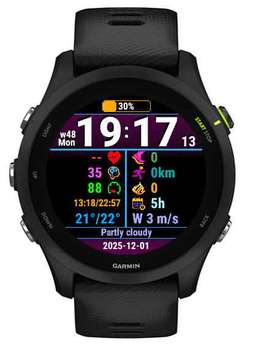

# Garmin Forerunner 255 Music Watch Face

A custom watch face specifically designed for the Garmin Forerunner 255 Music. This watch face has been developed for my personal needs and is tailored exclusively for this device model.

The reason I created this watch face is since all the good ones that fits my needs has three times been bait and switch ones (via ConnectIQ), that were once free and suddenly went paid. So I decided to make my own, that fits my needs, and is free forever!



## Device Compatibility

**This watch face only supports the Garmin Forerunner 255 Music.**

It has not been developed or tested for any other Garmin devices. The code is written to be specific to my requirements and includes no configuration options.

## Development

### Prerequisites

- Docker and Docker Compose
- The [connectiq-sdk-docker](https://github.com/waterkip/connectiq-sdk-docker/tree/master) container
- USB cable to connect your watch
- `jmtpfs` for mounting the watch filesystem (and `fusermount`)

### API Documentation

Official Garmin Connect IQ API documentation is available at:
https://developer.garmin.com/connect-iq/api-docs/

## Building

1. Clone this repository and the connectiq-sdk-docker repository
2. Run the development container with your project mounted:
(You might need to adjust the docker compose to your needs)

```bash
docker compose run --rm connectiq
```

3. Inside the container, build the release version:

```bash
# Release
make run-release
# Or debug 
make run-debug
```

## Installation

1. Connect your watch to your computer via USB cable

2. Mount the watch using `jmtpfs` (wait a bit, can take some seconds to be able to mount it):

```bash
jmtpfs garmin
```

3. Copy the compiled watch face to your watch:

```bash
cp bin/fr255m-YourProject-3.2.6.release.prg ~/garmin/Internal\ Storage/Garmin/Apps
```

4. Safely unmount the watch and disconnect the USB cable

```bash
fusermount -u garmin
```

5. On your watch, navigate to the watch face selector and choose the newly installed watch face

## License

MIT License - See LICENSE file for details


